# 🌍 End-to-End MERN Application Deployment & Monitoring
**with Terraform, Ansible, Prometheus, and Grafana**

This project provisions AWS infrastructure, deploys a MERN stack application, configures MongoDB, and sets up observability with Prometheus & Grafana — all using Infrastructure as Code and Configuration Management.

## 📌 Project Structure

```
├── terraform/        # Infrastructure provisioning (EC2, SG, IAM, etc.)
│   ├── iam.tf
│   ├── main.tf
│   ├── networking.tf
│   ├── output.tf
│   ├── providers.tf
│   ├── security_groups.tf
│   ├── variables.tf
│   ├── terraform.tfvars.example # sample .tfvar file
├── ansible/          # Configuration management (Web + DB setup)
│   ├── inventory.ini
│   ├── site.yml
│   ├── roles/
│   │   ├── web/      # Web/Frontend/Backend setup
│   │   └── db/       # MongoDB setup
├── monitoring/       # Prometheus + Grafana configs
│   ├── metrics.js
│   ├── prometheus.yml
└── output/           # Output screenshots

```

## 1️⃣ Infrastructure (Terraform)

- Provisions 2 EC2 instances in AWS (Ubuntu):
  - Web server → MERN (frontend + backend)
  - DB server → MongoDB
- Creates Security Groups:
  - Web: allows SSH (22), HTTP (80/3000), Backend (3001), Metrics (4001)
  - DB: allows SSH (22), MongoDB (27017) only from Web SG
- Outputs public IPs of both servers

**Commands**

```
cd terraform
terraform init
terraform plan -var-file="terraform.tfvars"
terraform apply -var-file="terraform.tfvars" -auto-approve
```

**Output - Terraform**

- **Terraform Plan**

  > 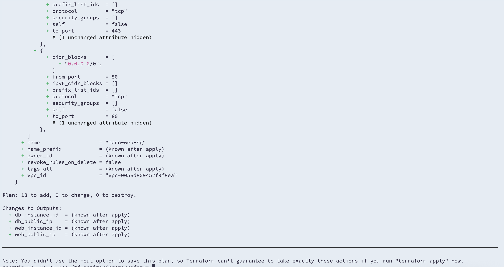

- **Terraform apply**

  > 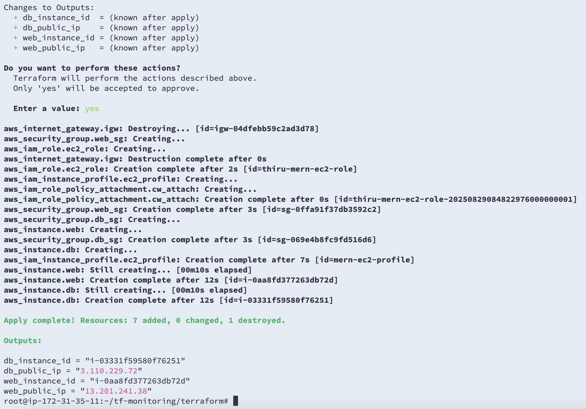

## 2️⃣ Configuration (Ansible)

**🔧 Ansible Setup & Prerequisites**

Ansible runs from a control node (your laptop or a dedicated EC2 instance).

Make sure you have:
- Python 3.x installed
- Ansible 

On Ubuntu/Debian:

```
sudo apt update
sudo apt install -y python3 python3-pip
pip3 install ansible
```

Verify: `ansible --version`

**Generate and Configure SSH Key**

You need an SSH key to connect to your EC2 instances:

`ssh-keygen -t rsa -b 4096 -f ~/.ssh/mern-key`

- Upload the public key to AWS when creating the key pair (Terraform uses this).
- The private key (.pem) should be accessible to Ansible.

Check permissions:

`chmod 600 ~/.ssh/mern-key.pem`


**Configure Inventory**

`ansible/inventory.ini` should contain your EC2 IPs:

```
[web]
<web-ec2-ip> ansible_user=ubuntu ansible_ssh_private_key_file=~/.ssh/key.pem

[db]
<db-ec2-ip> ansible_user=ubuntu ansible_ssh_private_key_file=~/.ssh/key.pem
```

**Web Role**
- Installs `Node.js` & `npm`
- Clones TravelMemory MERN repo
- Creates `.env` for backend & frontend
- Installs dependencies
- Starts backend on `:3001` and frontend on `:3000` using `PM2`

**DB Role**
- Installs MongoDB
- Configures user/database
- Restricts MongoDB access to web server only

**Run**
`ansible-playbook -i inventory.ini site.yml`

**Output - Ansible**

- **Web EC2 Success**

  > 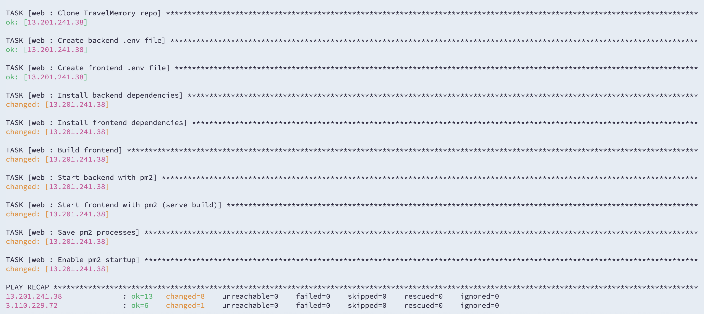

- **DB EC2 Success**

  > 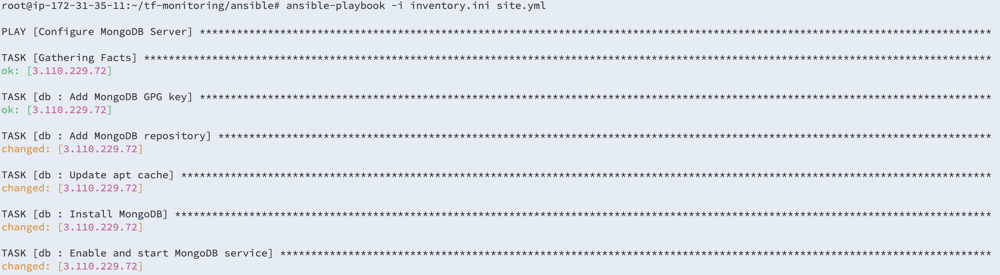

- **PM2 Status**

  > 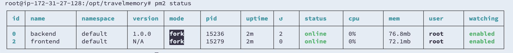

**Output - Travel Memory Application**

- **API Success**

  > 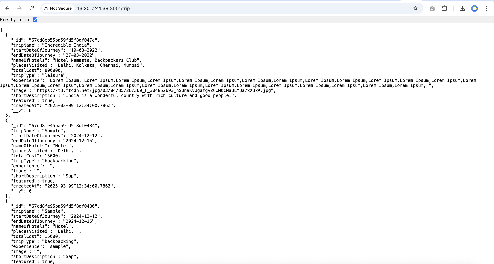

- **Home page**

  > 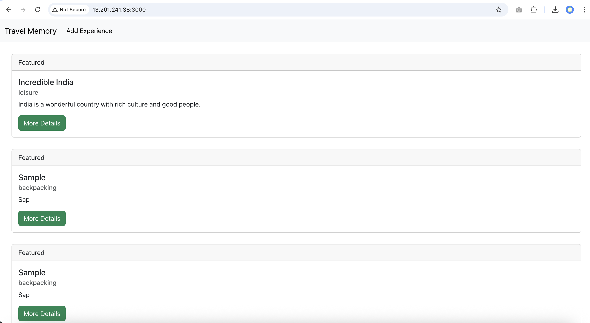

- **Details Page**

  > 

- **Add Page**

  > 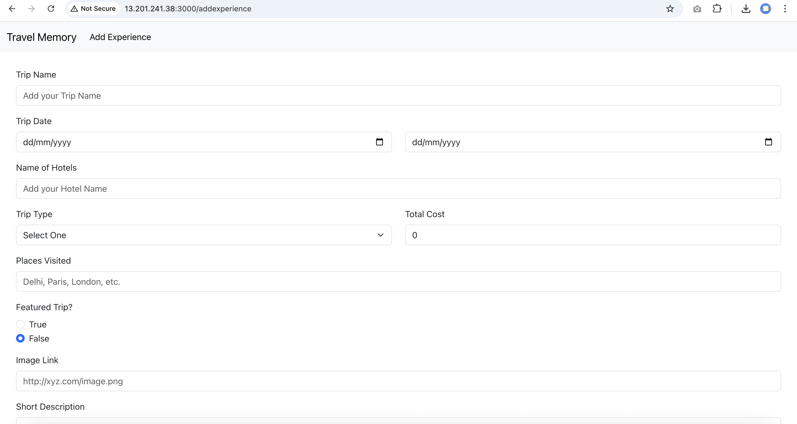

## 3️⃣ Monitoring (Prometheus + Grafana)

#### Set Up Prometheus

**1. Download Prometheus**

```
cd /opt
sudo wget https://github.com/prometheus/prometheus/releases/download/v2.54.1/prometheus-2.54.1.linux-amd64.tar.gz
sudo tar xvf prometheus-2.54.1.linux-amd64.tar.gz
sudo mv prometheus-2.54.1.linux-amd64 prometheus
```

**2. Create Prometheus user** 

```
sudo useradd --no-create-home --shell /bin/false prometheus
sudo mkdir /etc/prometheus /var/lib/prometheus
sudo chown prometheus:prometheus /etc/prometheus /var/lib/prometheus
```

**3. Move binaries**
```
cd /opt/prometheus
sudo cp prometheus promtool /usr/local/bin/
sudo chown prometheus:prometheus /usr/local/bin/prometheus /usr/local/bin/promtool
sudo cp -r consoles/ console_libraries/ /etc/prometheus/
sudo chown -R prometheus:prometheus /etc/prometheus
```

**⚙️ Configure Prometheus**

Create config file:
`sudo nano /etc/prometheus/prometheus.yml`

```
global:
  scrape_interval: 15s

scrape_configs:
  - job_name: 'prometheus'
    static_configs:
      - targets: ['localhost:9090']

  - job_name: 'backend'
    static_configs:
      - targets: ['localhost:4000']   # <- your Node.js backend /metrics port
```

**🖥 Create Systemd Service**

`sudo nano /etc/systemd/system/prometheus.service`

```
[Unit]
Description=Prometheus
Wants=network-online.target
After=network-online.target

[Service]
User=prometheus
Group=prometheus
Type=simple
ExecStart=/usr/local/bin/prometheus \
  --config.file /etc/prometheus/prometheus.yml \
  --storage.tsdb.path /var/lib/prometheus/ \
  --web.console.templates=/etc/prometheus/consoles \
  --web.console.libraries=/etc/prometheus/console_libraries

[Install]
WantedBy=multi-user.target
```

**🚀 Start Prometheus**

```
sudo systemctl daemon-reexec
sudo systemctl enable prometheus
sudo systemctl start prometheus
systemctl status prometheus
```

**Output - Prometheus**

- **Prometheus Portal**

  > 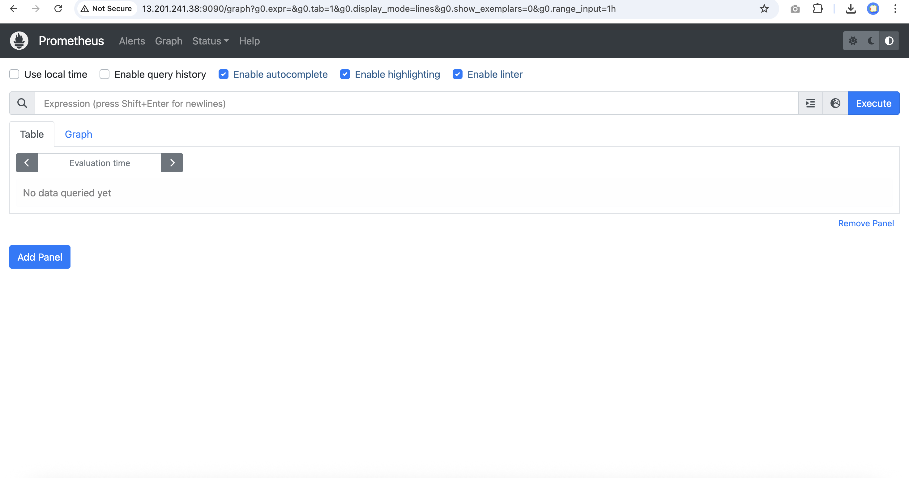

- **Prometheus - Service Setup**

  > 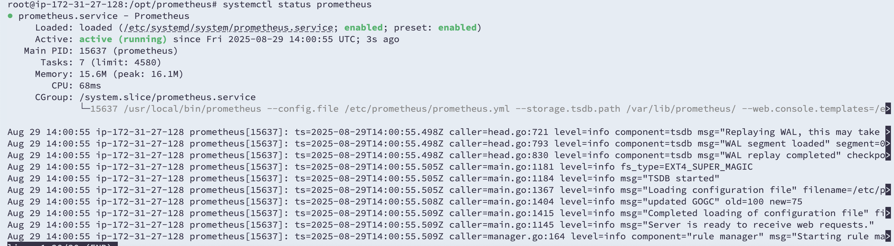


- **Prometheus - Targets used**

  > 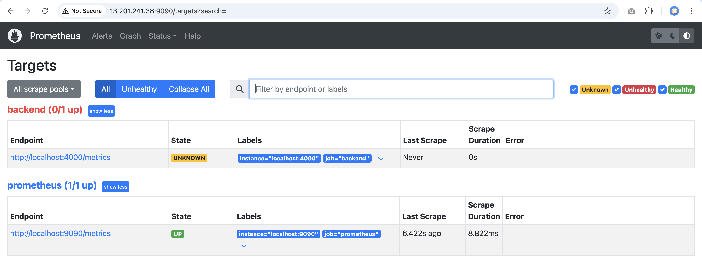

  
#### Set Up Grafana and Metrics.js

- Installed on web server (http://<web-ip>:3000)
- Add Prometheus as a data source (http://<EC_IP>>:9090)
- Dashboards:
  - Backend request count, error rate, latency
  - MongoDB performance metrics
  - Frontend availability

**📊 Grafana Dashboards**

Grafana provides pre-built dashboards from Grafana Labs

- Node.js / Prometheus App Metrics → Dashboard ID: `11074` (Shows Node.js metrics like event loop lag, memory usage, HTTP requests, etc.)
- MongoDB Exporter Dashboard → Dashboard ID: `2583` (Shows MongoDB operations, latency, connections, and performance stats)
- Node Exporter Full (System Metrics) → Dashboard ID: `1860` (Shows CPU, memory, disk, and network usage for EC2)

**📥 Steps to Import a Dashboard**

- In Grafana, go to Dashboards → Import.
- Enter the Dashboard ID (e.g., 11074) from Grafana Labs.
- Select your Prometheus data source.
- Click Import.

**Application Metrics (metrics.js)**

We use `prom-client` to expose custom application metrics for Prometheus.

A dedicated metrics server runs on port `4001`, exposing a `/metrics` endpoint.

**🔧 Run with PM2**

`pm2 start metrics.js --name metrics --watch`

From outside (after opening port 4001 in EC2 Security Group):

`http://<EC2-Public-IP>:4001/metrics`

**📈 Prometheus Config**

Add this job to `prometheus.yml`:

```
scrape_configs:
  - job_name: "node_app"
    static_configs:
      - targets: ["localhost:4001"]
```

**Output - Grafana Setup**

- **Add Data Source**

  > 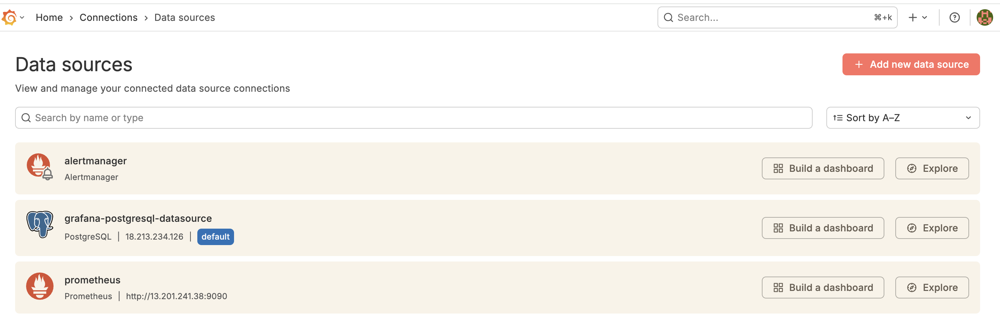

- **Grafana Dashboard**

  > 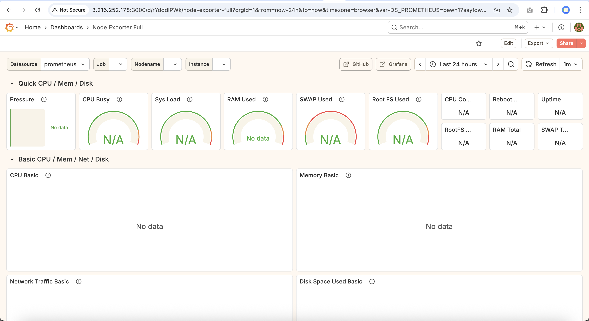

## 4️⃣ Alerts & Anomaly Detection

Configured in Grafana:

- **Error Rate > 5%**
  ```
  (sum(rate(http_requests_total{status=~"5.."}[5m])) 
  / sum(rate(http_requests_total[5m]))) * 100
  ```
- **MongoDB latency > 200ms**
  ```
    avg(rate(mongodb_mongod_op_latencies_latency_microseconds_total[5m])) / 1000
  ```


**Output - Grafana Alert**

- **Alert List**

  > 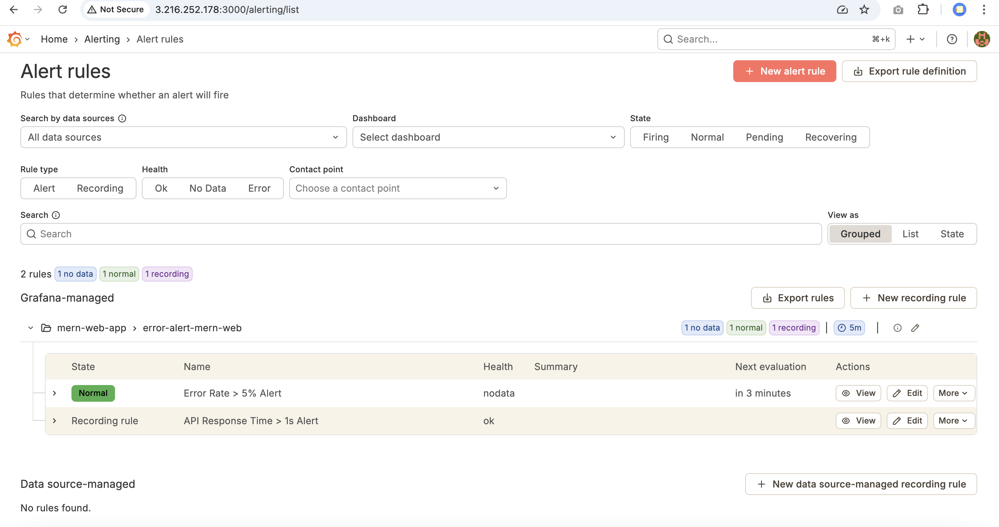


- **Alert - Error Rate > 5%**

  > 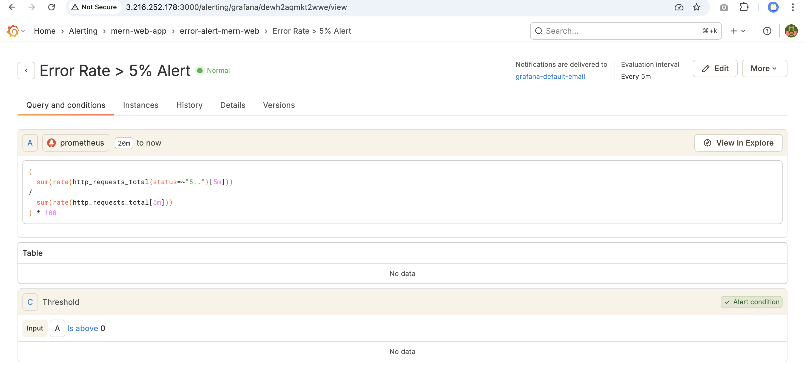
